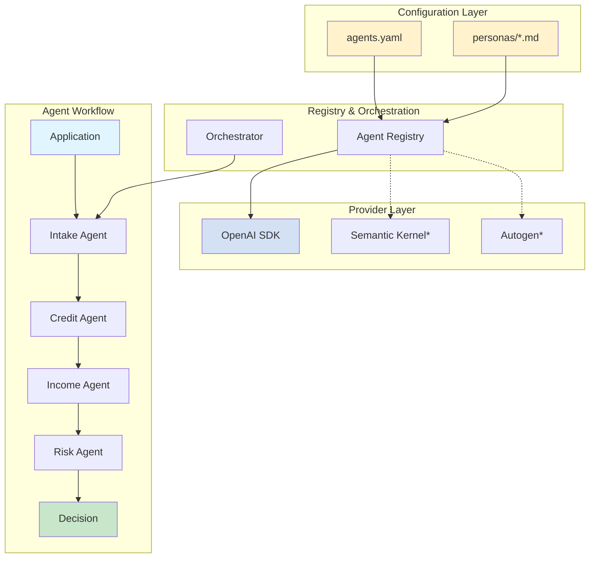

# Multi-Agent Loan Processing System

[](https://opensource.org/licenses/MIT)
[](https://www.python.org/downloads/)
[](https://github.com/openai/agents-api)
[](https://github.com/astral-sh/uv)

[](#testing)
[](#testing)
[](https://github.com/charliermarsh/ruff)
[](https://mypy.readthedocs.io/)

---

## 🚀 Developer Quick Start

**Just want to code?** Skip the theory and jump straight to:

- **[Quick Start (3 steps)](#quick-start-3-steps)** - Get running in under 2 minutes
- **[Architecture Overview](#-agent-registry-configuration-driven-architecture)** - How the system works
- **[Add Your Own Agent](#development-agent-integration)** - Extend the system
- **[Testing & Coverage](#testing)** - Test suite and validation
- **[Business Case](#the-business-impact-ai-projected-estimates)** - Why this matters

---

> **Experimental multi-agent system** demonstrating AI agent orchestration patterns that are vendor SDK agnostic:

## 🔬 Core Hypotheses

This experimental system tests two fundamental hypotheses about AI-assisted development and multi-agent architectures:

### Hypothesis 1: Domain based Tool Agnostic Agent Architecture
**"Business logic can be completely separated from agent SDK implementation through configuration-driven design"**

The system demonstrates:
- **Multi-Agent Orchestration Patterns**: Sequential (implemented), Parallel, Conditional, and Hierarchical (planned)
- **Domain-Driven Agent Personas**: Agent behaviors crafted from loan industry expertise and market analysis
- **Business Logic in Configuration**: YAML/Markdown files instead of code
- **Multiple Agent SDK Support**: Provider model enables OpenAI, Autogen, Semantic Kernel integration
- **Separation of Concerns**: Clean boundaries between agents, orchestration, and business logic

**Results**: 
- [Domain expert personas](docs/agent-patterns.md) for credit, income, and risk assessment
- [Configuration-driven orchestration](docs/agent-strategy.md#configuration-driven-agent-management) patterns
- [Agent registry](loan_processing/agents/providers/openai/agentregistry.py) with [YAML-based configuration](loan_processing/agents/shared/config/agents.yaml)
- [MCP servers](loan_processing/tools/mcp_servers/) for autonomous tool selection

### Hypothesis 2: Human-AI Team Development
**"One human developer can effectively orchestrate a team of specialized AI sub-agents to build complex systems"**

This repository was built using Claude Code as the primary developer, working with specialized sub-agents:
- 🏗️ **System Architecture Reviewer** - Validated design decisions and system impacts
- 🔍 **Code Reviewer** - Ensured code quality and architectural alignment
- 📊 **Product Manager Advisor** - Aligned features with business value
- 🎨 **UX/UI Designer** - Validated user experience decisions
- 🚀 **GitOps CI Specialist** - Managed Git operations and CI/CD pipeline success

**Results**: 
- [Our Human-AI collaboration methodology](docs/agent-based-development.md)
- [Design decisions made with AI agent input](docs/decisions/)
- IDE Tools Synchronization Strategy ([CLAUDE.md](CLAUDE.md), [Copilot](.github/instructions/copilot-instructions.md), [Cursor](.cursorrules), [Sync Strategy](.github/sync-instructions.md))

---

> 🤖 **Demonstrating Human-AI Team Development**: This repository proves that one human can orchestrate a team of specialized AI agents to build complex, well-architected systems. Built entirely through Claude Code + specialized sub-agents collaboration in 72 hours.
> 
> **Current Scope**: We've tested with one agent SDK (OpenAI Agents SDK) and one orchestration pattern (sequential). We're still learning and will expand to more SDKs and patterns as we evolve. [Learn about our approach →](docs/agent-based-development.md)

### Key Features
- ✅ **Multi-Agent Orchestration**: Sequential, parallel, and conditional coordination patterns
- ✅ **Multiple Framework Support**: Business logic separated from SDK - supports OpenAI, Semantic Kernel, Autogen through provider model
- ✅ **Configuration-Driven Design**: YAML-based agent creation and orchestration without code changes
- ✅ **MCP Tool Servers**: Agents autonomously select from 15+ tools across 3 specialized servers
- ✅ **Type-Safe Communication**: Pydantic models ensure structured data validation between agents
- ✅ **Observable Agent Interactions**: OpenTelemetry integration tracks decisions, handoffs, and performance
- ✅ **AI-Powered Development**: Built using Claude Code with 5 specialized development agents

### Business Impact Projections
Performance metrics and cost reduction claims are **AI-generated projections** based on typical loan processing analysis and have **not been independently benchmarked**. Actual results depend on:
- System complexity and integration requirements
- Regulatory environment and compliance obligations
- Data characteristics and processing volume
- Implementation approach and team expertise

**A living experiment in configuration-driven, vendor-agnostic multi-agent orchestration**

## The Business Impact *(AI-Projected Estimates)*

| Current State | With Multi-Agent System | Projected Gain* |
|--------------|------------------------|-----------|
| 3-5 days processing | 3-5 minutes | **99.8% faster** |
| $50-75 per application | $6-10 per application | **88% cost reduction** |
| 8-12% error rate | <2% error rate | **80% fewer errors** |
| Manual review bottlenecks | Automated intelligent routing | **10x scalability** |

*Projections are AI-generated estimates for demonstration purposes. Actual results may vary.

**Estimated ROI: 416% in Year 1** for organizations processing 1,000+ applications/month  
[→ See detailed business case](docs/business-case.md)

## 🎯 Key Architecture Benefits

### Configuration-Driven Flexibility
- **Agent Registry Pattern**: Create agents through YAML configuration, not code
- **Orchestration Patterns**: Extensible from simple sequential to complex parallel workflows
- **Provider Agnostic**: Switch between OpenAI, Azure OpenAI, Semantic Kernel, Autogen without changing business logic
- **Rapid Iteration**: Modify agent behavior through persona files, deploy instantly

### Development Excellence
- **AI-Assisted Development**: Integration with Claude Code, GitHub Copilot, Cursor, and specialized development agents
- **Quality Automation**: Comprehensive testing (204 tests, 75% coverage), linting, and CI/CD
- **Separation of Concerns**: Clean architecture with decoupled console apps and backend services
- **Security by Design**: Privacy-first with secure applicant IDs (never SSN), comprehensive audit trails

### Enterprise Readiness
- **Multi-Provider Support**: Reduce vendor lock-in risk through abstracted provider layer
- **Extensible Architecture**: Add new agents, tools, and orchestration patterns without core changes
- **Compliance Framework**: Built-in FCRA, ECOA, TILA regulatory compliance patterns
- **Production Patterns**: Error handling, monitoring, timeout management, and scalability

### Agent Collaboration Patterns
- **Sequential Processing**: Agents build on each other's assessments
- **Parallel Evaluation**: Independent agents work simultaneously (planned)
- **Conditional Routing**: Dynamic workflow based on application characteristics (planned)
- **Context Accumulation**: Each agent enriches shared context for better decisions

## 📋 Agent Registry: Configuration-Driven Architecture

Our system uses a configuration-first approach to agent management:

### Simple YAML Configuration
```yaml
agents:
  intake:
    name: "Intake Agent"
    persona_file: "intake"
    mcp_servers: ["application_verification"]
    capabilities: ["Application validation", "Identity verification"]
```

### Automatic Agent Creation
```python
# No more complex initialization code
from loan_processing.agents.providers.openai.agentregistry import AgentRegistry

agent = AgentRegistry.create_agent("intake", model="gpt-4")
```

### Provider Flexibility
```yaml
# Switch providers through configuration
provider_config:
  openai:           # Current implementation
    model: "gpt-4"
  semantic_kernel:  # Future support
    model: "gpt-4"
  autogen:         # Planned integration
    model: "gpt-4"
```

## Quick Start (3 Steps)

```bash
# 1. Clone and install (using uv package manager)
git clone https://github.com/niksacdev/multi-agent-system.git
cd multi-agent-system
uv sync

# 2. Configure your API provider
cp .env.example .env
# Edit .env with your OpenAI or Azure OpenAI credentials

# 3. Interactive startup - one command does it all!
./start.sh          # Unix/Linux/macOS  
# OR
start.bat           # Windows
```

**Experience the magic!** The interactive startup script:
- ✅ Checks your environment automatically
- 🚀 Starts all MCP data services with progress indicators  
- 🎉 Waits for everything to be ready
- 🤖 Prompts you when ready to process loans
- 🧹 Cleans up everything when you exit

### 🔧 Alternative: Manual Setup

If you prefer more control, you can start components separately:

```bash
# Option 1: Start MCP servers first, then console app
python start_mcp_servers.py
uv run python run_console_app.py

# Option 2: Check server status
python start_mcp_servers.py --status

# Option 3: Stop servers manually  
python start_mcp_servers.py --stop
```

## How It Works


*Planned provider support

Five specialized agents collaborate through configuration-driven orchestration:
- **Intake Agent**: Validates and enriches application data (optimized for speed)
- **Credit Agent**: Assesses creditworthiness comprehensively  
- **Income Agent**: Verifies income and employment stability
- **Risk Agent**: Synthesizes findings into risk assessment
- **Orchestrator**: Coordinates workflow based on YAML configuration

[→ Learn about the architecture](docs/agent-strategy.md)

## Architecture: Decoupled by Design

This system uses a **clean separation** between backend services and client applications:

```
multi-agent-system/
├── loan_processing/        # 🏗️ Pure backend module
│   ├── agents/            # Agent registry & orchestration
│   │   ├── providers/     # Provider implementations (OpenAI, etc.)
│   │   └── shared/        # Shared config, personas, utils
│   ├── tools/             # MCP servers & business services
│   └── utils/             # Common utilities
├── console_app/           # 🖥️ Standalone console client
│   ├── config/            # App-specific configuration
│   ├── src/main.py        # Decoupled application logic
│   └── .env               # Environment-based settings
└── scripts/               # 🔧 Utility scripts
```

### 🎯 **Benefits of This Architecture**

- **🔧 Provider Agnostic**: Swap AI providers without changing business logic
- **⚙️ Configuration-Driven**: Modify agents and workflows through YAML
- **🚀 Independent Deployment**: Backend and apps can be deployed separately
- **🧪 Clean Testing**: Pure backend logic separated from UI concerns
- **📦 Modular Development**: Teams can work on agents, orchestration, or apps independently
- **🔒 Security First**: Secure applicant IDs, no SSN exposure

## Documentation

| For | Start Here |
|-----|------------|
| **Business Context** | [Business Case & ROI Analysis](docs/business-case.md) |
| **Architecture** | [Agent Strategy & Registry Pattern](docs/agent-strategy.md) |
| **Developers** | [Agent Patterns](docs/agent-patterns.md) & [Data Models](docs/data-models.md) |
| **Orchestration** | [Orchestration Patterns](docs/orchestration-patterns.md) |

## Testing

Our codebase maintains high quality standards with comprehensive testing:

- **204 Tests Passing** - Complete test coverage including MCP servers
- **75% Coverage** - Comprehensive testing of critical components  
- **Automated CI/CD** - All PRs automatically tested via GitHub Actions
- **Quality Gates** - Ruff linting, type checking, and code formatting enforced
- **Development Agents** - Code review, architecture, and PM agents validate changes

### Running Tests Locally

```bash
# Install dependencies
uv sync

# Run complete test suite
uv run pytest tests/ -v

# Run with coverage report
uv run pytest tests/ -v --cov=loan_processing --cov-report=term-missing

# Run all quality checks
uv run python scripts/validate_ci_fix.py
```

### Test Organization

- **Agent Registry Tests** (28 tests): Agent creation, configuration, MCP server factory
- **Orchestration Tests** (53 tests): Sequential pattern executor, engine, and base classes
- **Integration Tests** (10 tests): Scenario testing and end-to-end validation
- **Utility Tests** (10 tests): Safe evaluator, configuration loader, output formatter
- **Persona Tests** (20 tests): Persona loading, path validation, and content handling
- **Coverage**: 83% overall with comprehensive test suite of 204 tests

## Development Agent Integration

This project uses specialized AI agents for development:

- **🔍 Code Reviewer Agent**: Reviews code for best practices and architecture alignment
- **🏗️ System Architecture Agent**: Validates design decisions and system impacts
- **📊 Product Manager Agent**: Ensures business value alignment and requirements
- **🎨 UX/UI Designer Agent**: Validates user experience and interface design

These agents work with:
- GitHub Copilot
- Claude Code (Anthropic)
- Cursor IDE
- VS Code with AI extensions

## 🚀 Future Roadmap

### Orchestration Patterns (Q1-Q2 2025)
- **Parallel Processing**: Multiple agents working simultaneously for faster decisions
- **Conditional Routing**: Dynamic agent selection based on application characteristics
- **Hierarchical Orchestration**: Supervisor agents managing specialist sub-agents
- **Event-Driven Patterns**: Reactive agent activation based on system events
- **Saga Pattern**: Distributed transaction management across agents

### Framework Support (Q2-Q3 2025)
- **Microsoft Autogen**: Full integration with Autogen's conversational patterns
- **LangChain Agents**: Support for LangChain's agent framework
- **CrewAI**: Integration with CrewAI's role-based agent system
- **Custom Agent Frameworks**: Plugin architecture for proprietary agent systems
- **Semantic Kernel**: Microsoft's orchestration framework integration

### Application Interfaces (Q3-Q4 2025)
- **REST API**: Production-ready API for loan application processing
- **GraphQL Interface**: Flexible query interface for complex data needs
- **Web Application**: Modern React-based UI for loan applications
- **Mobile SDK**: iOS/Android SDKs for mobile loan applications
- **Webhook Integration**: Real-time status updates and notifications

### Enhanced Observability (Q1 2025)
- **Agent Communication Tracing**: Visual timeline of agent interactions
- **Decision Audit Trail**: Complete history of all agent decisions
- **Performance Metrics Dashboard**: Real-time monitoring of agent performance
- **A/B Testing Framework**: Compare different agent configurations
- **ML Ops Integration**: Model versioning and performance tracking

## License & Support

MIT License - See [LICENSE](LICENSE) for details

For questions, issues, or contributions, please see our [Contributing Guide](CONTRIBUTING.md)

---

Built with [OpenAI Agents SDK](https://github.com/openai/agent-framework) | [MCP Servers](https://github.com/anthropics/mcp) | AI-Assisted Development