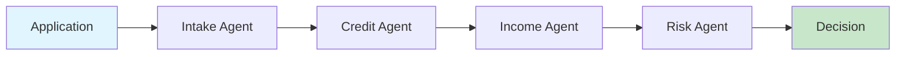

# Multi-Agent Loan Processing System

**Transform 3-5 day loan processing into 3-5 minute automated decisions**

## The Business Impact

| Current State | With Multi-Agent System | Your Gain |
|--------------|------------------------|-----------|
| 3-5 days processing | 3-5 minutes | **99.8% faster** |
| $50-75 per application | $6-10 per application | **88% cost reduction** |
| 8-12% error rate | <2% error rate | **80% fewer errors** |
| Manual review bottlenecks | Automated intelligent routing | **10x scalability** |

**ROI: 416% in Year 1** for organizations processing 1,000+ applications/month  
[→ See detailed business case](docs/getting-started/business-case.md)

## What This Demonstrates

A comprehensive example of **orchestrator patterns** and **domain-aligned agents** that automate end-to-end business processes. This system showcases:

- **Multi-Agent Orchestration**: Intelligent coordination between specialized AI agents using OpenAI Agents SDK
- **Domain-Driven Design**: Each agent represents a specific business domain (credit, income, risk)
- **Autonomous Tool Selection**: Agents intelligently choose appropriate tools and data sources
- **Complete Business Process Automation**: From application intake to final lending decisions

Beyond loan processing, this repository demonstrates modern AI development practices including Claude Code integration, GitHub Copilot workflows, and using AI agents for software development itself.

## Quick Start (3 Steps)

```bash
# 1. Clone and install (using uv package manager)
git clone https://github.com/yourusername/multi-agent-system.git
cd multi-agent-system
uv sync

# 2. Set your OpenAI API key
export OPENAI_API_KEY="your-key-here"

# 3. Run the demo
uv run python demo_sequential_processing.py
```

**That's it!** You'll see a complete loan processing workflow in action.

## How It Works



Five specialized agents collaborate to process loan applications:
- **Intake Agent**: Validates and enriches application data
- **Credit Agent**: Assesses creditworthiness comprehensively  
- **Income Agent**: Verifies income and employment stability
- **Risk Agent**: Synthesizes findings into risk assessment
- **Orchestrator**: Coordinates workflow and makes final decisions

Each agent uses the Jobs-to-be-Done framework to ensure customer-centric outcomes.  
[→ Learn about the architecture](docs/architecture/agent-strategy.md)

## Documentation

| For | Start Here |
|-----|------------|
| **Business Leaders** | [Business Case & ROI Analysis](docs/getting-started/business-case.md) |
| **Technical Evaluators** | [Architecture Overview](docs/architecture/agent-strategy.md) |
| **Developers** | [Implementation Guide](docs/getting-started/quick-start.md) |
| **Product Teams** | [Jobs-to-be-Done Framework](docs/architecture/jobs-to-be-done.md) |

## Key Capabilities

✅ **Intelligent Automation** - Agents autonomously select appropriate tools  
✅ **Regulatory Compliance** - Built-in FCRA, ECOA, TILA compliance  
✅ **Privacy-First** - Uses secure IDs, never exposes sensitive data  
✅ **Production-Ready** - Error handling, monitoring, and scalability built-in  
✅ **Extensible** - Easy to add new agents and capabilities  

## License & Support

MIT License - See [LICENSE](LICENSE) for details

For questions, issues, or contributions, please see our [Contributing Guide](CONTRIBUTING.md)

---

Built with [OpenAI Agents SDK](https://github.com/openai/agent-framework) | [MCP Servers](https://github.com/anthropics/mcp)