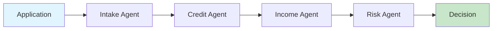

# Multi-Agent Loan Processing System

[](https://opensource.org/licenses/MIT)
[](https://www.python.org/downloads/)
[](https://github.com/openai/agents-api)
[](https://github.com/astral-sh/uv)

[](#testing)
[](#testing)
[](https://github.com/charliermarsh/ruff)
[](https://mypy.readthedocs.io/)

> 🤖 **Moving Beyond Vibe Coding**: This repository demonstrates structured Human-AI collaboration using Claude and specialized development agents to create maintainable code. [Learn about our approach →](docs/agent-based-development.md)

**Transform 3-5 day loan processing into 3-5 minute automated decisions**

## The Business Impact

| Current State | With Multi-Agent System | Your Gain |
|--------------|------------------------|-----------|
| 3-5 days processing | 3-5 minutes | **99.8% faster** |
| $50-75 per application | $6-10 per application | **88% cost reduction** |
| 8-12% error rate | <2% error rate | **80% fewer errors** |
| Manual review bottlenecks | Automated intelligent routing | **10x scalability** |

**ROI: 416% in Year 1** for organizations processing 1,000+ applications/month  
[→ See detailed business case](docs/getting-started/business-case.md)

## What This Demonstrates

A comprehensive example of **orchestrator patterns** and **domain-aligned agents** that automate end-to-end business processes. This system showcases:

- **Multi-Agent Orchestration**: Intelligent coordination between specialized AI agents using OpenAI Agents SDK
- **Domain-Driven Design**: Each agent represents a specific business domain (credit, income, risk)
- **Autonomous Tool Selection**: Agents intelligently choose appropriate tools and data sources
- **Complete Business Process Automation**: From application intake to final lending decisions

Beyond loan processing, this repository demonstrates modern AI development practices including Claude Code integration, GitHub Copilot workflows, and using AI agents for software development itself.

## Quick Start (3 Steps)

```bash
# 1. Clone and install (using uv package manager)
git clone https://github.com/niksacdev/multi-agent-system.git
cd multi-agent-system
uv sync

# 2. Configure your API provider
cp console_app/.env.example console_app/.env
# Edit console_app/.env with your OpenAI or Azure OpenAI credentials

# 3. Run the console application
uv run python run_console_app.py
```

**That's it!** You'll see a complete loan processing workflow in action.

## How It Works



Five specialized agents collaborate to process loan applications:
- **Intake Agent**: Validates and enriches application data
- **Credit Agent**: Assesses creditworthiness comprehensively  
- **Income Agent**: Verifies income and employment stability
- **Risk Agent**: Synthesizes findings into risk assessment
- **Orchestrator**: Coordinates workflow and makes final decisions

Each agent uses the Jobs-to-be-Done framework to ensure customer-centric outcomes.  
[→ Learn about the architecture](docs/architecture/agent-strategy.md)

## Architecture: Decoupled by Design

This system uses a **clean separation** between backend services and client applications:

```
multi-agent-system/
├── loan_processing/        # 🏗️ Pure backend module
│   ├── agents/            # Agent orchestration engine
│   ├── tools/             # MCP servers & business services
│   └── ...                # No client apps here!
├── console_app/           # 🖥️ Standalone console client
│   ├── config/            # App-specific configuration
│   ├── src/main.py        # Decoupled application logic
│   └── .env               # Environment-based settings
└── web_app/               # 🌐 Future web client (planned)
```

### 🎯 **Benefits of This Architecture**

- **🔧 Future-Ready**: When `loan_processing` becomes an API service, apps are already decoupled
- **⚙️ Flexible Configuration**: Each app manages its own OpenAI/Azure OpenAI settings  
- **🚀 Independent Deployment**: Backend and apps can be deployed separately
- **🧪 Clean Testing**: Pure backend logic separated from UI concerns
- **📦 Modular Development**: Teams can work on backend vs. frontend independently

The console app demonstrates **configuration-driven** pattern discovery - no more hardcoded filesystem traversal!

## Documentation

| For | Start Here |
|-----|------------|
| **Business Context** | [Business Case & ROI Analysis](docs/getting-started/business-case.md) |
| **Architecture** | [Agent Strategy](docs/architecture/agent-strategy.md) |
| **Developers** | [Implementation Guide](docs/getting-started/quick-start.md) |
| **UX Research** | [Jobs-to-be-Done Framework](docs/architecture/jobs-to-be-done.md) |

## Key Capabilities

✅ **Intelligent Automation** - Agents autonomously select appropriate tools  
✅ **Regulatory Compliance** - Built-in FCRA, ECOA, TILA compliance  
✅ **Privacy-First** - Uses secure IDs, never exposes sensitive data  
✅ **Production-Ready** - Error handling, monitoring, and scalability built-in  
✅ **Extensible** - Easy to add new agents and capabilities  

## Testing

Our codebase maintains high quality standards with comprehensive testing:

- **38 Tests Passing** - Core functionality thoroughly tested
- **91% Coverage** - High test coverage on critical components  
- **Automated CI/CD** - All PRs automatically tested via GitHub Actions
- **Quality Gates** - Ruff linting, type checking, and code formatting enforced

### Running Tests Locally

```bash
# Install dependencies
uv sync

# Run core test suite
uv run pytest tests/test_agent_registry.py tests/test_safe_evaluator.py -v

# Run with coverage report
uv run pytest tests/test_agent_registry.py tests/test_safe_evaluator.py -v \
  --cov=loan_processing.agents.providers.openai.agentregistry \
  --cov=loan_processing.agents.shared \
  --cov-report=term-missing

# Run all quality checks
uv run python validate_ci_fix.py
```

### Test Organization

- **Core Tests**: Stable test suite for production-critical components
- **Legacy Tests**: Marked for refactoring as architecture evolves  
- **Integration Tests**: End-to-end workflow validation (in development)

## License & Support

MIT License - See [LICENSE](LICENSE) for details

For questions, issues, or contributions, please see our [Contributing Guide](CONTRIBUTING.md)

---

Built with [OpenAI Agents SDK](https://github.com/openai/agent-framework) | [MCP Servers](https://github.com/anthropics/mcp)